# Visualizing Transformer

- by **Jack Li**
- email1: **jackli777777 AT gmail.com**
- email2: **jackli777777 AT qq.com**

中文版，请点击[这里](https://jackli7777777.gitee.io/3b1b-some2-2022/)

> #### Version Info
- V1.0 2022-08-09 work submitted to **3Blue1Brown**'s **Summer of Math Exposition 2**
- V1.1 2022-08-12 change the heat map gradient to 🌈colormap gradient ranging from <strong><font color="#7F00FF">purple</font></strong> to <font color="#FF0000">red</font></strong>, and update the accompanying **[3D interactive website](https://jackli777.github.io/visualizing-ai/)** correspondingly, and all the pngs, gifs in this blog.

> #### Notes

- This blog is an entry to the **Summer of Math Exposition 2**, hereinafter referred to as **SoME2** ([YouTube](https://www.youtube.com/watch?v=hZuYICAEN9Y), [Bilibili](https://www.bilibili.com/video/BV1fZ4y1a7zZ)), which is an event organized by **3Blue1Brown**, hereinafter referred to as **3b1b** ([YouTube](https://www.youtube.com/c/3blue1brown), [Bilibili](https://space.bilibili.com/88461692)).

- This blog may be better digested by readers with a certain **linear algebra** and **deep learning** foundation, but since the presentation of this blog combines **3D visual interaction**, I believe it is more intuitive than the traditional text + picture manner, and it is easier to be consumed by the general public. If you want to understand the basics of **linear algebra** and **deep learning**, here is a series of animation video courses launched by the organizer **3b1b**: **linear algebra** ([YouTube](https://www.youtube.com/playlist?list=PLZHQObOWTQDPD3MizzM2xVFitgF8hE_ab), [Bilibili](https://space.bilibili.com/88461692/channel/seriesdetail?sid=1528927)), **deep learning** ([YouTube](https://www.youtube.com/playlist?list=PLZHQObOWTQDNU6R1_67000Dx_ZCJB-3pi), [Bilibili](https://space.bilibili.com/88461692/channel/seriesdetail?sid=1528929)). I became a loyal fan of **3b1b** after watching the animation video series produced by **3b1b** (╯°□°)╯.

- This blog and the supporting **[3D interactive website](https://jackli777.github.io/visualizing-ai/)** are based on the jupyter notebook ([ch16-part1-self-attention.ipynb](https://github.com/rasbt/machine-learning-book/blob/main/ch16/ch16-part1-self-attention.ipynb)) published by **Prof. Sebastian Raschka** ([personal homepage](https://sebastianraschka.com/), [GitHub homepage](https://github.com/rasbt)), combined with my understanding, addition, modification, and creation. This notebook is also one of the accompanying notebooks for Chapter 16 of the book **Machine Learning with PyTorch and Scikit-Learn** authored by **Prof. Sebastian Raschka**, and interested readers can also purchase it for further reference. **Prof. Sebastian Raschka** has also launched a video course series including the **self-attention mechanism** and **Transformer architecture** ([L19.4.2 Self-Attention and Scaled Dot-Product Attention](https://www.youtube.com/watch?v=0PjHri8tc1c&list=PLTKMiZHVd_2KJtIXOW0zFhFfBaJJilH51&index=161), [L19.4.3 Multi-Head Attention](https://www.youtube.com/watch?v=A1eUVxscNq8&list=PLTKMiZHVd_2KJtIXOW0zFhFfBaJJilH51&index=162), and [L19.5.1 The Transformer Architecture](https://www.youtube.com/watch?v=tstbZXNCfLY&list=PLTKMiZHVd_2KJtIXOW0zFhFfBaJJilH51&index=163)) for your reference.

- The interactions supported by the **[3D interactive website](https://jackli777.github.io/visualizing-ai/)** accompanying this blog include **panning**, **zooming**, and **rotation** of the view. The content includes the computation process of the **self-attention mechanism**, the **scaled dot product attention mechanism** and the **multi-head attention mechanism**. It is divided into **21 scenes**, which can be freely switched by the reader.

- The following is a brief introduction to the use and operation of the **[3D interactive website](https://jackli777.github.io/visualizing-ai/)** (the specific meaning of its content will be explained in detail later on): 
  - You will be directed to the **1st scene** by default when you visit the website for the first time. The upper right corner is the **control panel**, which can be **opened/closed** by yourself. The control panel includes **adding/deleting the light source**, **adding/deleting grid lines**, **adding/deleting axes**, **adding/deleting shadows**, and **scene switching drop-down menu**. The upper left corner is the **frame rate information** of the current page.

  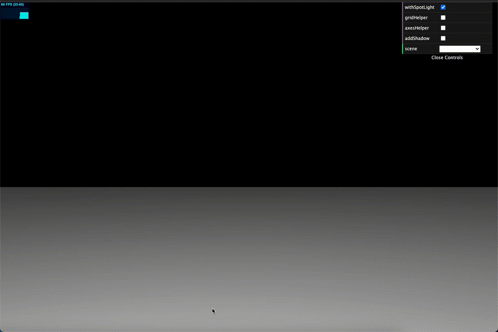

  - Take the **1st scene** as an example, right-click any position and drag it to **pan** the current view.

  

  - Move the mouse scroll wheel down or up to **zoom in or out** of the current view.

  

  - Left-click and drag any position to **rotate** the view. Combined with the above **panning** and **zooming** operations, you can achieve 360° viewing at any angle in the scene.

  


> #### Introduction
- **Transformer** (Vaswani, A. et al. 2017) has swept all corners of the AI ​​fields since it was proposed in 2017, from the original natural language processing (**NLP**) (original Transformer (Vaswani, A. et al. 2017), **ELMo** series (Matthew E. . et al. 2018), **GPT** series (Brown, T. et al. 2020), **BERT** series (Devlin, J. et al. 2018)) to image and video understanding (**ViT** (Dosovitskiy, A. et al. 2020) ), to biological sequence analysis (Rives, A. et al. 2021, Nambiar, A. et al. 2020, Rao, R. et al. 2019), to protein structure prediction (**AlphaFold2** (Jumper, J. et al. 2021) published on **Nature**, also the last year’s great breakthrough in scientific researches, [**2021 BREAKTHROUGH OF THE YEAR**](https://www.science.org/content/article/breakthrough-2021)) and so on. **Transformer is now everywhere.** The original paper (**Attention is all you need**) has reached the number of citations in Google Scholar an astonishing 48,914 times (2022-08-09 at the time of writing V1.0 of this blog)!

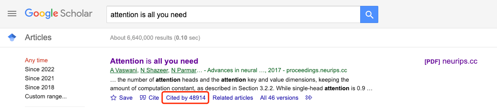

- "...if now going to the machine learning the part that's surprising is... so we like architectures like neural networks, and I would say this was a very rapidly evolving field until the **Transformer** came, so **attention might indeed be all you need** which is the title, also a good title although in hindsight is good I don't think at the time I thought this is a great title for a paper, but that architecture is proving that the dream of modeling sequences of any bytes, there is something there that will stick, and I think these advances in architectures, in kind of how neural networks and architectures to do what they do, um it's been hard to find one that has been so **stable** and relatively has **changed very little** since it was invented five or so years ago, so that is a **surprise** that keeps recurring into all the projects..." —— quotes from **Oriol Vinyals**, the Research Director and Deep Learning Lead at DeepMind, [Oriol Vinyals: Deep Learning and Artificial General Intelligence | Lex Fridman Podcast #306](https://www.youtube.com/watch?v=aGBLRlLe7X8)

- Today, with the rapid development and brilliance of AI technology, I think it is necessary to have a clear and in-depth understanding of Transformer. Whether you are a scholar or a practitioner in the field of AI, or one of the general public, I believe that by reading this blog and exploring the supporting **[3D interactive website](https://jackli777.github.io/visualizing-ai/)** personally, you will nevertheless gain something. To tell the truth, it is through making the above 3D interactive website and writing this blog, that I have a clearer understanding of Transformer myself!

- This blog focuses on the core computation process of Transformer (in **deep learning terms**, it is part of a **forward propagation** process in either the **encoder** or **decoder** in the **Transformer architecture**): **self-attention mechanism**, **scaled dot product attention mechanism**, and **multi-head attention mechanism** are introduced in detail. The implementation of Transformer is based on the refinement and simplification of the original paper by **Prof. Sebastian Raschka** ([personal homepage](https://sebastianraschka.com/), [GitHub homepage](https://github.com/rasbt)). You can refer to his published jupyter notebook ([ch16-part1-self-attention.ipynb](https://github.com/rasbt/machine-learning-book/blob/main/ch16/ch16-part1-self-attention.ipynb)). Based on my understanding, addition, and modification, I created the above-mentioned 3D interactive website and this blog.


> #### Motivation
- Since Transformer became popular, there have been a lot of research papers, blogs, videos, etc., to extend and explain Transformer from all angles and aspects. Just like Transformer's original paper, the same popular contents are as follows:
  - BERT (Devlin, J. et al. 2018), another milestone research achievement in the NLP field based on Transformer, has an astonishing 45,791 citations in Google Scholar, which is close to the original text of Transformer (upon this blog V1.0 2022-08-09)!
  - The Annotated Transformer ([new version](http://nlp.seas.harvard.edu/annotated-transformer/), [old version](http://nlp.seas.harvard.edu/2018/04/03/attention.html)) implements the original Transformer paper through PyTorch and supplements it with 2D pictures and tables.
  - [The Illustrated Transformer](https://jalammar.github.io/illustrated-transformer/) explains the original paper through a large number of cartoon drawings, and the author [Jay Alammar](https://jalammar.github.io/) himself has a corresponding [video explanation](https://youtu.be/-QH8fRhqFHM).
- There were already some excellent works on topics such as **Transformer**, **Self-Attention Mechanism**, **Neural Network**, **Deep Learning**, etc. from last year's event, the [**SoME1**](https://www.3blue1brown.com/blog/some1-results#all-entries) as well. Here are some examples:
  - [Attention mechanism - An In-depth Analysis and Walkthrough](https://shaunaksen.hashnode.dev/attention-mechanism-an-in-depth-analysis-and-walkthrough-part-1), is a detailed, computer-science-style tutorial with mathematical formulas and 2D animations.
  - [From Recurrent Neural Network (RNN) to Attention explained intuitively](https://medium.com/@cakraww/from-recurrent-neural-network-rnn-to-attention-explained-intuitively-7fd7caeef6af) uses 2D animations to illustrate the development and connection from recurrent neural network (RNN) to attention mechanism.
  - [The Attention Mechanism Demystified](https://mehta-rohan.com/writings/blog_posts/attention.html)(the [original url](https://mehta-rohan.com/#/blog-posts/intuitive_attention_via_the_transformer) listed by **3b1b** is no longer valid, but similar work found from the content creator's personal website) explains the attention mechanism with beautiful 2D pictures.
  - [Convolutional Neural Networks Explained (CNN Visualized)](https://www.youtube.com/watch?v=pj9-rr1wDhM&list=PLnQX-jgAF5pTkwtUuVpqS5tuWmJ-6ZM-Z&index=531) explains the working principle of the feedforward neural network(FFN) and the convolutional neural network(CNN) through a series of very cool animations. I believe you will be amazed by the beauty and quality of this work as much as I am!
- From my experience in using Transformer-related models, even with the above-mentioned high-quality explanations, I still cannot confidently say that I fully understand the computation process of Transformer. The reason may be because of the **granularity** of the explanation (such as The Annotated Transformer does not further decompose the computation process of the attention mechanism) and the **precision** of the response to the code (for example The Illustrated Transformer has simplified explanations through a large number of cartoon pictures, but there is no response to the code implementation), the similar situation applies to those wonderful works related to Tranformer from [**SoME1**](https://www.3blue1brown.com/blog/some1-results#all-entries), the current explanation blog posts, videos, etc. are still insufficient in my opinion.

- Based on the above status quo, I think it is necessary to launch an explanation fashion with a finer **granularity** of the explanation of the computation process and a higher **precision** in response to the code. Specifically, it is the **[3D interactive website](https://jackli777.github.io/visualizing-ai/)** supporting this blog.
  - Why **3D**?
    - The computation process of a deep learning model often involves the computation of a large number of vectors, matrices, or tensors. Especially, the computation of tensors is often more than 2D, and the 2D is not as good as 3D in expressing the information of **high-dimensional space** (**what is a tensor?** You can refer to [Introduction to Tensors](https://www.youtube.com/watch?v=uaQeXi4E7gA))
  - Why **interactive**?
    - Static images are not as **vivid** as animations or interactives, and animations are not as **active** and **immersive** as interactives from the user's perspective.
- The computation process of a deep learning model often involves a large number of vectors, matrices or tensors. Although it generally does not relate to very esoteric mathematical principles, its engineering complexity is often very high, and the computation process of many tensors often happens in **high-dimensional space**. That is often the main reason why deep learning-related papers or codes are difficult to understand. This blog and the supporting website hope to provide new insights, angles and directions into understanding the computation process of deep learning models through a 3D+interactive fashion.

- Let us now dive into the detailed computation process of Transformer:

> #### Computation Process

- When Transformer was first proposed, it applied the deep learning architecture to the task of sequence(sentences are sequence of words)-to-sequence mapping, i.e. machine translation, and its core computation process involves the **multi-head**, **parameterized**, **scaled dot product** **self-attention mechanism**.

- Assume we have an input sentence (sequence of words) that we encode via a dictionary, which maps the words to integers. To simplify the problem, let's assume this dictionary consists of only 10 words and the sentence consists of 8 words:

```python
# input sequence / sentence:
#  "Can you help me to translate this sentence"

sentence = torch.tensor(
    [0, # can
     7, # you     
     1, # help
     2, # me
     5, # to
     6, # translate
     4, # this
     3] # sentence
)

print(sentence)
```

```
tensor([0, 7, 1, 2, 5, 6, 4, 3])
```

- It can be seen vividly from the **1st scene**:

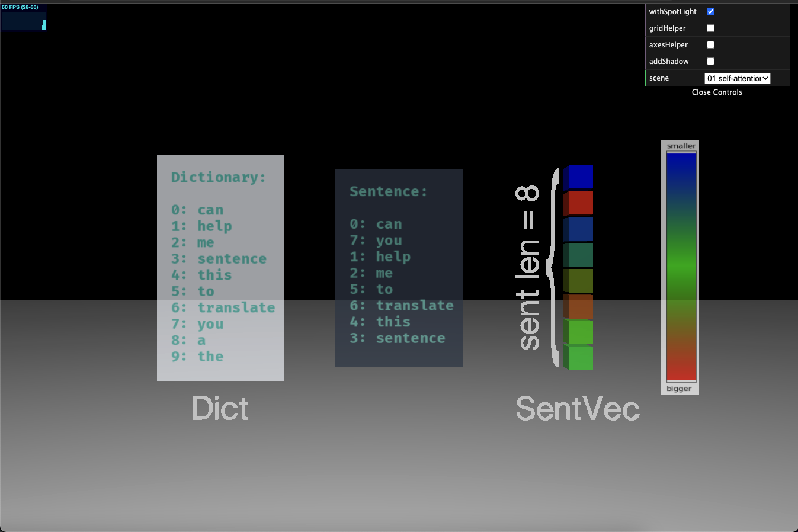

- The different colors of each small cube in all scenes represent different **numerical values**. The **relative relationship** between them can be seen from the 🌈colormap gradient on the right, that is to say, the closer to the <strong><font color="#FF0000">red</font></strong> end, the larger the value, and the closer to the <strong><font color="#7F00FF">purple</font></strong> end, the smaller the value.

- In the **1st scene**, the different colors of the cubes represent the **index** of each word in the dictionary.

- Next, we initialize a **word embedding** mapping matrix, i.e. each word is represented as a real vector. Since the sentence has 8 words, there will be 8 vectors, each of which is 16-dimensional (the dimension of the **word embedding**):

  - **What is a word embedding?** You can refer to the **Word Embeddings** section in this blog [Deep Learning, NLP, and Representations](https://colah.github.io/posts/2014-07-NLP-RNNs-Representations/)

```python
embed = torch.nn.Embedding(10, 16)
```

- Vectorize each word in the sentence:

```python
embedded_sentence = embed(sentence).detach()
```

- View the dimension information after vectorization:

```python
print(embedded_sentence.size())
```

- There are 8 words in total, and each word becomes a 16-dimensional word embedding after vectorization:

```
torch.Size([8, 16])
```

- In the **2nd scene**, we can see that each word is mapped into a 16-dimensional word embedding.

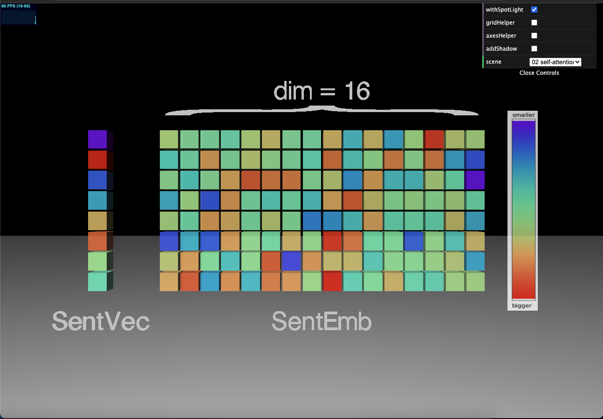

- One thing to note here is that although the color of each small cube represents its numerical value, the **relative size** of each numerical value is **restricted** to the vector, matrix, or tensor where the cube locates. In other words, the colors of cubes from two different vectors, matrices, or tensors do not reflect the numerical relativity between those two cubes.

- The reason why this restriction is made when generating the color for each cube is that the **numerical value span** in all vectors, matrices, or tensors from all 21 scenes is **too large**. If the color of each small cube is generated separately after calculation from all 21 scenes, then the colors of each cube in the same vector, matrix, or tensor are almost **indistinguishable**. So unless a vector, matrix, or tensor itself (or their rank-shifted form) appears twice, the numerical values represented by the colors between the cubes from different vectors, matrices or tensors are not **comparable**.


> ##### Self-attention

- For self-attention mechanism, the goal is to compute the **context vectors** $\boldsymbol{z}^{(i)}=\sum_{j=1}^{T} \alpha_{i j} \boldsymbol{x}^{(j)}$, which involve **attention weights matrix** $\alpha_{i j}$.
- In turn, the **attention weights matrix** $\alpha_{i j}$ involves the **$\omega_{i j}$ matrix**:

$$\omega_{i j}=\boldsymbol{x}^{(i)^{\top}} \boldsymbol{x}^{(j)}$$

- Actually, let's compute the **$\omega$ matrix** more efficiently by using the **matrix multiplication**:

```python
omega_mat = embedded_sentence.matmul(embedded_sentence.T)

print(omega_mat.size())
```

```
torch.Size([8, 8])
```

- This is also what the **3rd scene** shows:

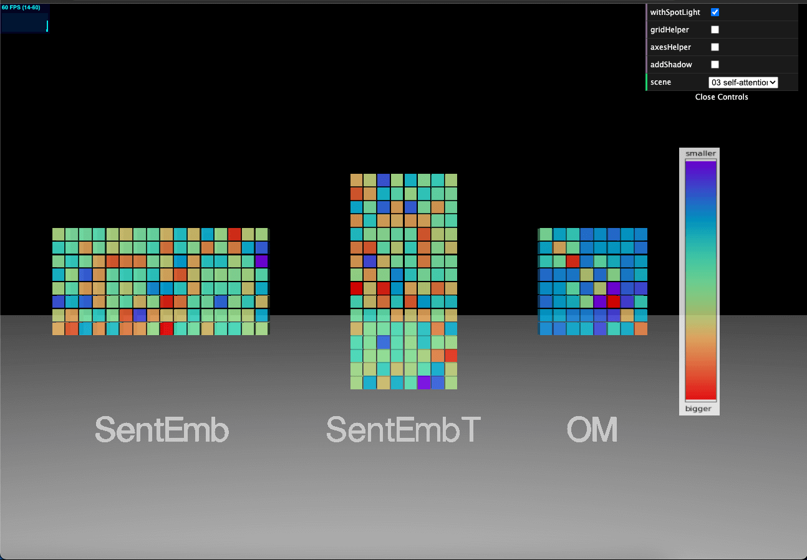

- Next, we get the **attention weight matrix** by normalizing the **$\omega$ matrix** **along the last dimension** (the sum of the values ​​along the last dimension is 1):

$$\alpha_{i j}=\frac{\exp \left(\omega_{i j}\right)}{\sum_{j=1}^{T} \exp \left(\omega_{i j}\right)}=\operatorname{softmax}\left(\left[\omega_{i j}\right]_{j=1 \ldots T}\right)$$

$$\sum_{j=1}^{T} \alpha_{i j}=1$$

```python
attention_weights = F.softmax(omega, dim=1)

print(attention_weights.size())
```

```
torch.Size([8, 8])
```

- We can also clearly see the direction along which the **normalization** operation is taking through the **4th scene**:


- The meaning of the row and column of the attention weight matrix $\alpha_{i j}$:
  - row: each input(word)
  - column: the **attention weights** of each input relative to all other inputs (including the input itself) (**normalized by Softmax** across all columns within a row)

- Note that attention_weights is an $8 \times 8$ matrix, where each element represents an **attention weight**, $\alpha_{ij}$. For instance, if we are processing the $i$th input word, the $i$th row of this matrix contains the
corresponding attention weights for all words in the sentence. These attention weights indicate **how
relevant** each word is to the $i$th word. Hence, the **columns** in this attention matrix should sum to $1$,
which we can confirm via the following code:

```python
attention_weights.sum(dim=-1)
```

```
tensor([1.0000, 1.0000, 1.0000, 1.0000, 1.0000, 1.0000, 1.0000, 1.0000])
```

- There is a **corollary** here, since the $i$th word is exactly the same as itself, the value on the **diagonal** of the attention weight matrix $\alpha_{i j}$ is the largest, which can be confirmed by the following code:

```python
torch.argmax(attention_weights, dim=-1)
```

```
tensor([0, 1, 2, 3, 4, 5, 6, 7])
```

```python
torch.argmax(attention_weights, dim=0)
```

```
tensor([0, 1, 2, 3, 4, 5, 6, 7])
```

- It can be seen that the index of the maximum value is the same as that of both the row and column, which means that the value on the **diagonal** of the attention weight matrix $\alpha_{i j}$ is the largest. From the above gif, the color of each small cube on the **diagonal** confirms this point as well.

- Now we have the attention weight matrix $\alpha_{i j}$, we can compute the context vector for each word $\boldsymbol{z}^{(i)}=\sum_{j=1}^{T} \alpha_{i j} \boldsymbol{x}^{(j)}$

- More efficiently, we can use matrix multiplication:

```python
context_vectors = torch.matmul(
    attention_weights, 
    embedded_sentence
)

print(context_vectors.size())
```

```
torch.Size([8, 16])
```

- The shape of the **context vector $z^{(i)}$** for each word is the same as that of each **word embedding $x^{(i)}$**, which can help us understand their corresponding relationship.

- Similar to the word embedding of each input word saved in embedded_sentence, the dimension of the **context vector matrix** is ​​also $8 \times 16$, and the $i$th row in this matrix is ​​the **context vector** of the $i$th input word.

- This is exactly what the **5th scene** shows:

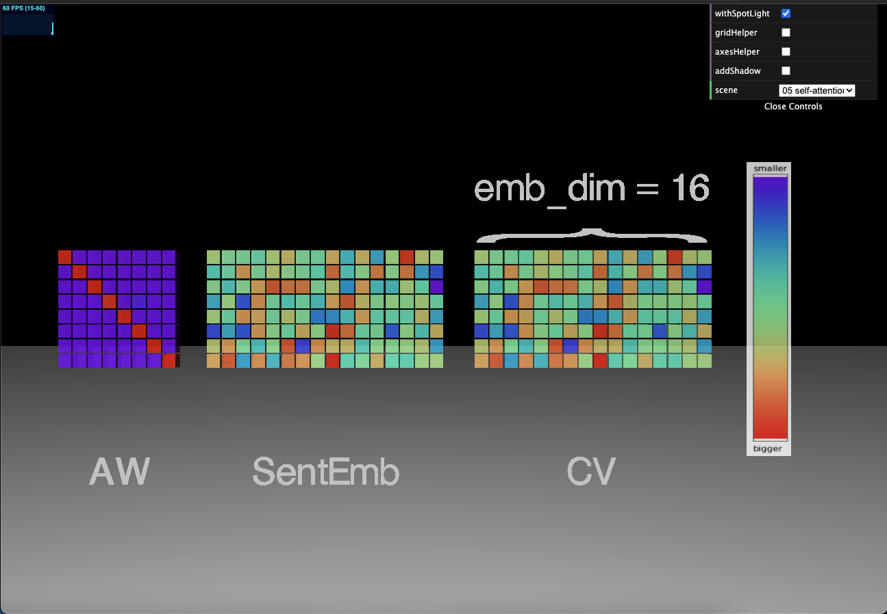

> ##### Scaled dot product

- The computation process of the above self-attention mechanism is only the **most simplified** version. Next, let's look at the computation process of the self-attention mechanism along with **parameters** and the **scaling factor**.

- First, we get the dimension information of the word embedding:

```python
d = embedded_sentence.size()[1]

print(d)
```

```
16
```

- To simplify, we initialize three **mapping matrices** (transition matrices) randomly, namely U_query, U_key, and U_value:

```python
# d_q and d_k must be the same, d_v can be different from d_k
d_k = d+1
d_v = d+2

U_query = torch.rand(d_k, d)
U_key = torch.rand(d_k, d)
U_value = torch.rand(d_v, d)
```

- Generally speaking, d_q, d_k, and d_v can be set consistently with the dimension of the word embedding, d. Although this is not a strict requirement, **d_q and d_k must be the same** (keeping only d_k from now on), and **d_v can be different from d_k**. To see the dimension information of each tensor more clearly later on, here d_k is set to d+1 and d_v to d+2.

- Let's look at the dimension information of each **mapping matrix** generated from the configurations:

```python
print(U_query.size())
```

```
torch.Size([17, 16])
```


```python
print(U_key.size())
```


```
torch.Size([17, 16])
```


```python
print(U_value.size())
```


```
torch.Size([18, 16])
```

- We show the above 3 **mapping matrices** in the **6th scene**:

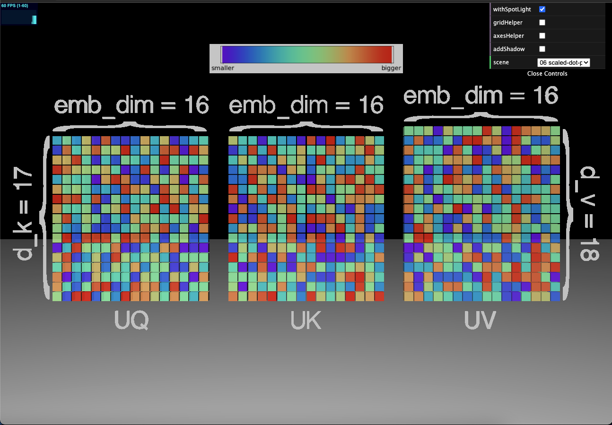

- Next, let us compute the **Q, K, and V matrices** by mapping operations separately:

```python
# queries is the Q matrix after mapping operation
queries = U_query.matmul(embedded_sentence.T).T

print(queries.size())
```

```
torch.Size([8, 17])
```

```python
# keys is the K matrix after mapping operation
keys = U_key.matmul(embedded_sentence.T).T

print(keys.size())
```

```
torch.Size([8, 17])
```


```python
# values is the V matrix after mapping operation
values = U_value.matmul(embedded_sentence.T).T

print(values.size())
```


```
torch.Size([8, 18])
```

- The computation process of the above **Q, K, and V matrices** is reflected in the **7th, 8th, and 9th scenes** respectively:

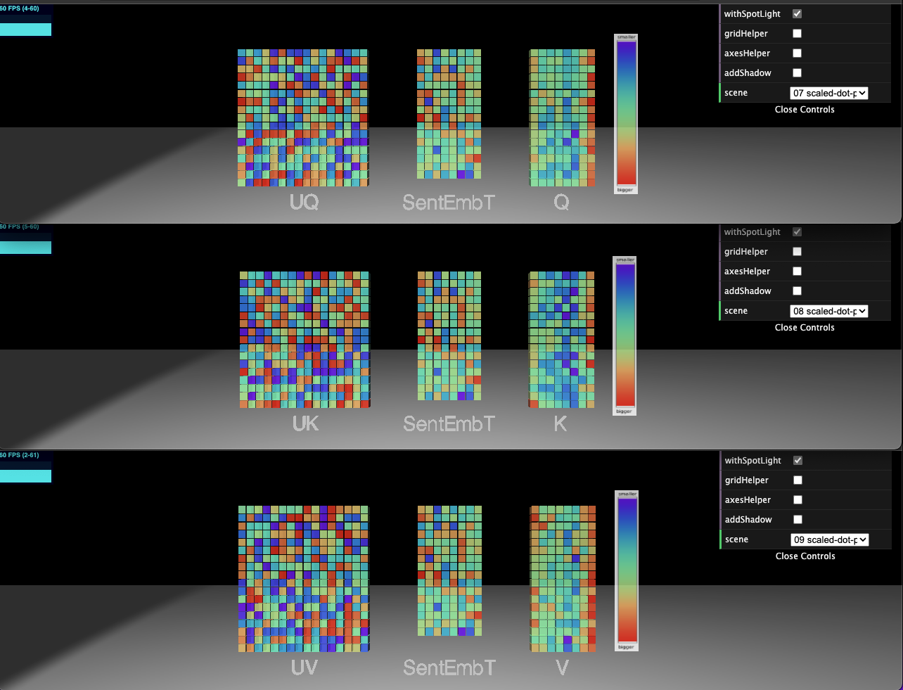

- In the previous section, the most simplified version of the self-attention mechanism, we computed the **unnormalized weights $\omega_{ij}$**, as the pairwise dot product between the given input sequence element, $x^{(i)}$, and the $j$th sequence element, $x^{(j)}$. Now, in this parameterized version of self-attention, we compute $\omega_{ij}$ as the dot product between the query and key:

$$
\omega_{ij} = q^{(i) T} k^{(j)}
$$


```python
omegas = queries.matmul(keys.T)

print(omegas.size())
```

```
torch.Size([8, 8])
```

- This is what the **10th scene** shows. By comparing it with the **3rd scene** above, you can find how the computation of the $\omega_{ij}$ matrix differs from not adding the parameters:

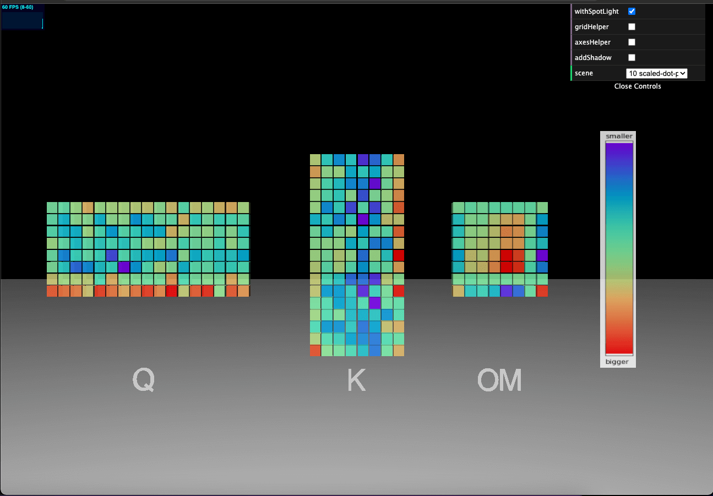

- Likewise, we get the **attention weight matrix** by normalizing $\omega_{ij}$ along its last dimension:

```python
attention_weights = F.softmax(omegas / d_k**0.5, dim=-1)

print(attention_weights.size())
```

```
torch.Size([8, 8])
```

- Note that **scaling** $\omega_{ij}$ by the **factor** $1/\sqrt{m}$, where typically $m = d_k$, ensures that the Euclidean length of the **weight
vectors** (row vectors in attention weights) will be approximately in the same range.

- Let's take a closer look at the **11th scene**. Smart as you are, you must have found out the difference by comparing it with the **4th scene**. We get a different attention weight matrice, which is the meaning of adding parameters —— let the model **learn more**!

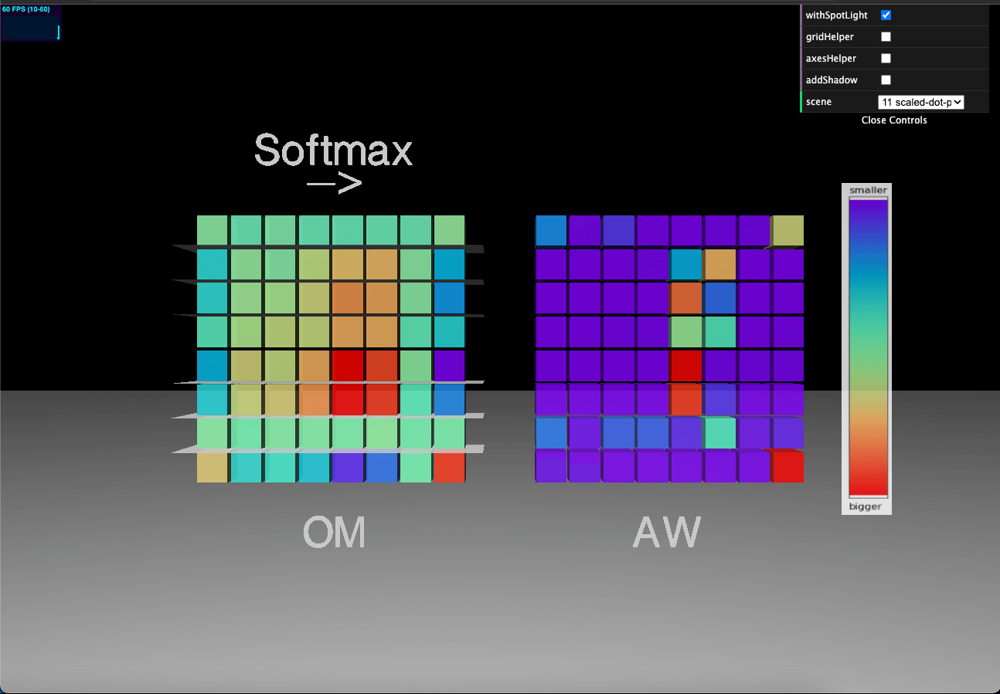

- Finally, the output is a **weighted average** of **value** sequences: $z^{(i)} = \Sigma_{j=1}^T \alpha_{ij} v^{j}$, which can be implemented as follows:

```python
context_vectors = attention_weights.matmul(values)

print(context_vectors.size())
```

```
torch.Size([8, 18])
```

- You can see how ​​different our new context vector matrix is by comparing the **12th scene** with the **5th one** above!

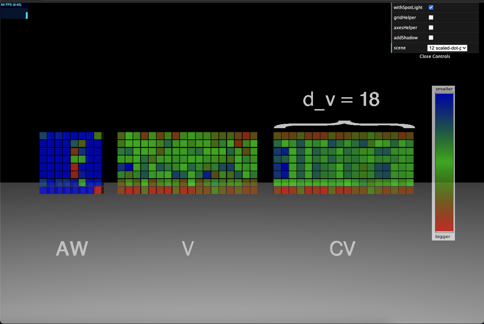


> ##### Multi-head Attention

- Finally, let's take a look at the computation process of the attention mechanism used in the original paper of Transformer (Vaswani, A. et al. 2017), that is, adding parameters such as U_query, U_key, U_value and the scaling factor, and the **multi-head attention mechanism** that will be explained in detail in the following.

- Similarly, we get the dimension information of the word embedding first, and set the values ​​of d_k and d_v:

```python
d = embedded_sentence.size()[1]

d_k = d+1
d_v = d+2
```

- In the previous section, the computation process of the scaled dot product attention mechanism with parameters, the initialized U_query is actually a **single-head** mapping matrix:

```python
one_U_query = torch.rand(d_k, d)
```

- Different from setting the number of heads to 8 in the original paper, we set the number of heads to 9 here, to view the dimension information of each tensor more conveniently later on:

```python
# h = 8
h = 9
```

- Next, we initialize the **multi-head** U_query, U_key, and U_value tensors:

```python
multihead_U_query = torch.rand(h, d_k, d)
multihead_U_key = torch.rand(h, d_k, d)
multihead_U_value = torch.rand(h, d_v, d)
```

- Let's take a look at the dimension information of each tensor initialized above:

```python
print(multihead_U_query.size())
```

```
torch.Size([9, 17, 16])
```

```python
print(multihead_U_key.size())
```

```
torch.Size([9, 17, 16])
```

```python
print(multihead_U_value.size())
```

```
torch.Size([9, 18, 16])
```

- By combining the **rotation**, **panning**, and **zooming** operations, we can see the number and direction of the **multi-heads** in the **13th scene**:


- Next, let's compute the multi-head **Q, K, V tensors**:

```python
multihead_queries = multihead_U_query.matmul(embedded_sentence.T)

print(multihead_queries.size())
```

```
torch.Size([9, 17, 8])
```

- Some readers may have questions here: how could the dot product take place between the two tensors multihead_U_query and embedded_sentence.T whose dimensions **do not match**? To give a quick answer, here PyTorch automatically completes the operation of **broadcasting** and **tensor multiplication** for us. For details, please refer to [TORCH.MATMUL](https://pytorch.org/docs/stable/generated/torch.matmul.html), [BROADCASTING SEMANTICS](https://pytorch.org/docs/stable/notes/broadcasting.html), and [Broadcasting](https://numpy.org/doc/stable/user/basics.broadcasting.html).

- In this case, the first dimension of the multihead_U_query tensor, that is, the dimension of the **number of heads** is regarded as the **number of batches**, does not participate in the subsequent dot product operation. And the embedded_sentence.T matrix, when multiplied with the former, needs to be **broadcasted** along the first dimension of the multihead_U_query tensor, in other words, by **copying itself h-1 times**, so that both tensors get matched in all dimensions. Now, for both tensors, the first dimension, the number of heads, is regarded as the batch, and the dot product can now take place in our familiar way by each pair of matrices from each batch.

- We adjust the dimension orders of the Q tensor in order to facilitate the subsequent computation of the $\omega$ tensor:

```python
multihead_queries = multihead_queries.swapaxes(1, 2)

print(multihead_queries.size())
```

```
torch.Size([9, 17, 8])
```

- Likewise, we compute the K and V tensors:

```python
multihead_keys = multihead_U_key.matmul(embedded_sentence.T)

print(multihead_keys.size())
```

```
torch.Size([9, 17, 8])
```

```python
multihead_values = multihead_U_value.matmul(embedded_sentence.T)

print(multihead_values.size())
```

```
torch.Size([9, 18, 8])
```

- The above computation process can be vividly shown in the **14th, 15th, and 16th scenes**, and we can also see more clearly how the embedded_sentence.T matrix replicates itself along the direction of the multi-head by the **broadcasting mechanism**!

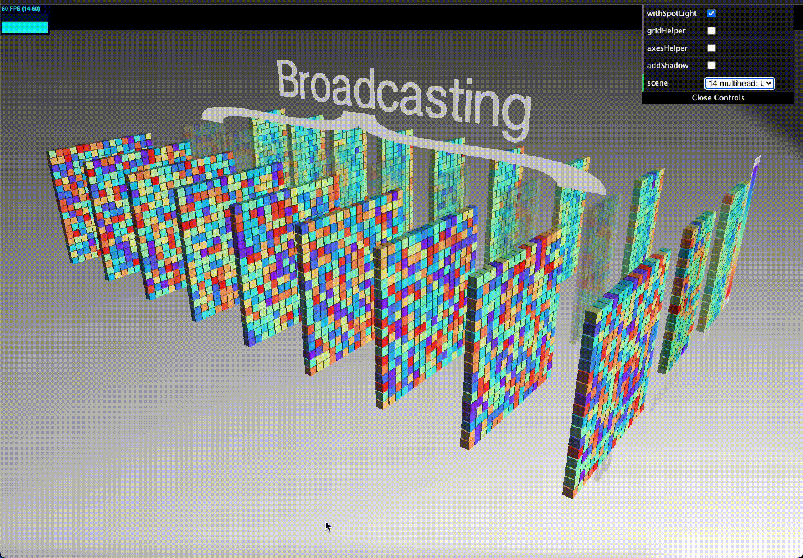

- In this code, we now have the **Q, K, V tensors** that refer to the **nine attention heads** in their first dimension. The second and third dimensions refer to the **embedding size (after mapping operation)** and the **number of words**, respectively. 

- Let us swap the second and third dimensions of K tensor so that the keys have a more intuitive representation, that is, the same dimensionality as the original input sequence embedded_sentence:

```python
multihead_keys = multihead_keys.permute(0, 2, 1)
print(multihead_keys.size())
```

```
torch.Size([9, 8, 17])
```

- Similar to the computation of the scaled dot product attention mechanism with parameters in the previous section, we obtain the multi-head $\omega$ tensor by taking the dot product of the Q and K tensors (here also leveraging the **tensor multiplication** operation implemented by PyTorch):

```python

multihead_omegas = multihead_queries.matmul(multihead_keys.swapaxes(1, 2))

print(multihead_omegas.size())
```

```
torch.Size([9, 8, 8])
```

- In the **17th scene**, by comparing it with the **10th scene** above, we find that each head learned something different!


- Likewise, by normalizing the $\omega$ tensor along its last dimension, we get the attention weight tensor for the multi-head version:

```python
multihead_attention_weights = F.softmax(multihead_omegas / d_k**0.5, dim=-1)

print(multihead_attention_weights.size())
```

```
torch.Size([9, 8, 8])
```

- Let's take a look at **what each head has learned** in the **18th scene**!

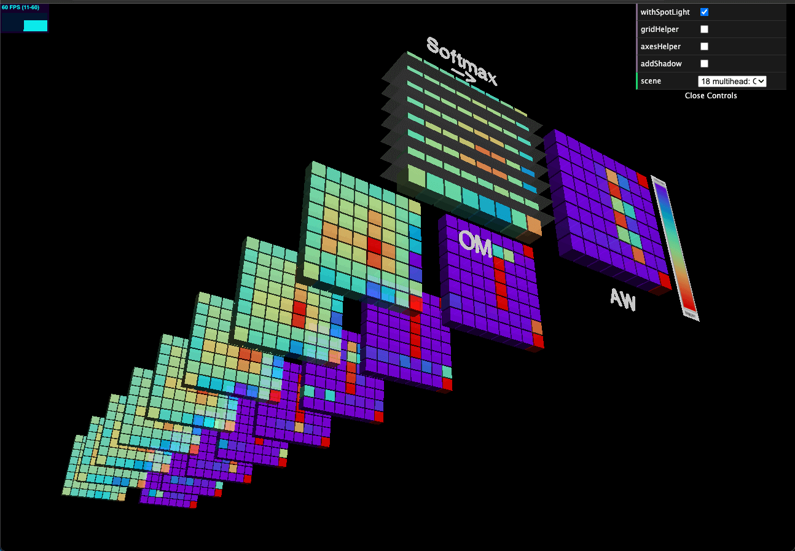

- Similarly, by computing the dot product of the attention weight tensor and the V tensor, we get the multi-head context vector tensor:

```python
multihead_context_vectors = multihead_attention_weights.matmul(multihead_values)

print(multihead_context_vectors.size())
```

```
torch.Size([9, 8, 18])
```

- The resulting different context vector matrices for each head can be seen in the **19th scene**:

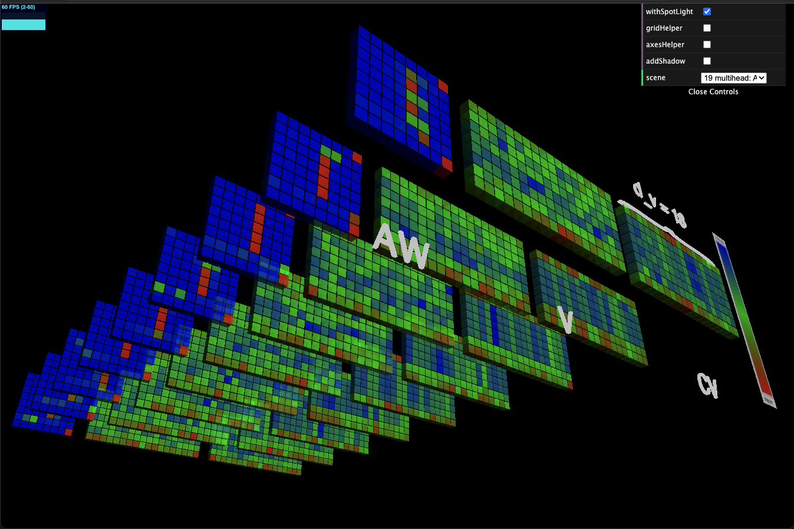

- Let's swap the first two dimensions of the resulting multi-head context vector tensor to facilitate subsequent merging operations on multi-heads:

```python
multihead_context_vectors = multihead_context_vectors.swapaxes(0, 1)

print(multihead_context_vectors.size())
```

```
torch.Size([8, 9, 18])
```

- Different from the previous section, we also need to merge the context vector tensor by its multiple heads:

```python
multihead_flattened = multihead_context_vectors.reshape(embedded_sentence.size()[0], h*d_v)

print(multihead_flattened.size())
```

```
torch.Size([8, 162])
```

- At this point we get a word embedding matrix with 8 rows and each of which has 162 dimensions (**the 20th scene**):

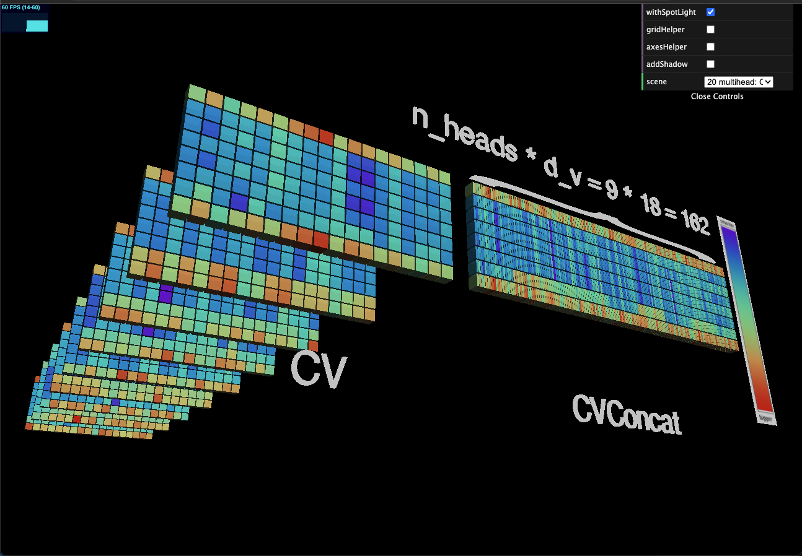

- We also need to map this merged context vector matrix back to the size of d_v, so we initialize a **linear map** first:

```python
linear = torch.nn.Linear(h*d_v, d_v)

print(linear)
```

```
Linear(in_features=162, out_features=18, bias=True)
```

- Finally, we map the combined context vector matrix back to the size of d_v by using the above **linear map**:

```python
multihead_context_vectors = linear(multihead_flattened)

print(multihead_context_vectors.size())
```

```
torch.Size([8, 18])
```

- In the **21st scene**, we can see that the dimension sizes of the context vector matrix are now consistent with the context vector matrix (shown in the **12th scene**) computed in the previous section:

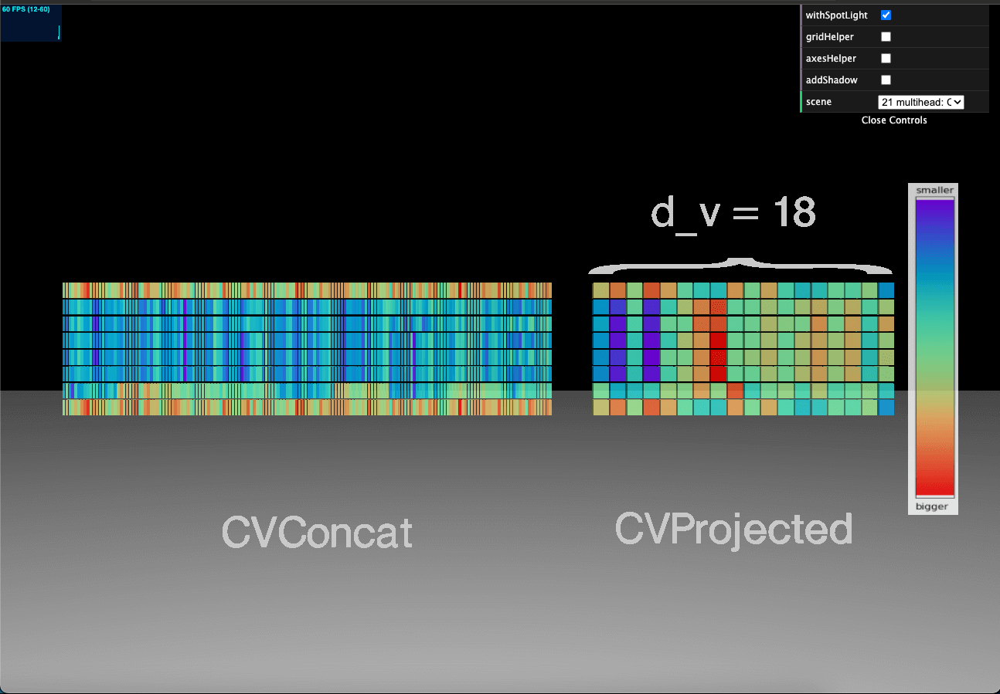

> #### Rethink and Future Work

- This blog uses **a total of 21 scenes** to visualize the computation process of the self-attention mechanism in Transformer, with a 3D interactive fashion for readers to **explore by themselves**. By making the above 3D interactive website and writing this blog, I have had a clearer understanding of the computation process of the attention mechanism in Transformer myself as well.

- Different from the previous schematic diagrams or simple 2D pictures, all the scenes in the above 3D interactive website, and the colors in each small cube are generated through strict code rules, and are strictly in accordance with the implementation of Transformer architecture, and thus can be regarded as a **3D interactive implementation** of the attention mechanism computation process in Transformer.

- The seperation of multiple scenes will help readers to make a set of **comparative studies** of the above computation process, so as to generate new insights for further in-depth exploration. Here are a few examples:
  - Comparing the resulting **$\omega$ matrix / tensor**: the 3rd, 10th, 17th scenes
  - Comparing the resulting **attention weight matrix / tensor**: the 4th, 11th, 18th scenes
  - Comparing the resulting **context vector matrix / tensor**: the 5th, 12th, 19th scenes

- The popularity of deep learning in recent years is not accidental, but the rationale behind it has always been a hot topic, such as **explainable AI (XAI)** that has emerged in recent years. Apart from being driven by our desire to explore the unknown world, AI's **robustness**, **fairness**, and **security** are increasingly being paid attention to in our society. **Visualization** as a means of conveying ideas has a natural advantage in **intuition** and is often the igniter of innovation. I believe the method proposed in this blog is inspiring and instructive for further exploration of the mathematical principles of AI.

- The computation process of the attention mechanism in Transformer introduced in this blog is only a small part of the forward propagation process, and it does not even discuss the **iterative process** involved in it. In addition, the Transformer's characteristic **positional encoding algorithm**, the **backward propagation** process, the **loss function**, the **optimizer**, and the **evaluation method** of the model performance are all aspects that are worth visualizing. I believe that if there are more abundant visualization works, it will produce more **comparative studies**, and will also generate more research directions, which are all worthy of continued in-depth work.

> #### References

- Vaswani, A., Shazeer, N., Parmar, N., Uszkoreit, J., Jones, L., Gomez, A.N., Kaiser, Ł. and Polosukhin, I., 2017. Attention is all you need. Advances in neural information processing systems, 30.
- Brown, T., Mann, B., Ryder, N., Subbiah, M., Kaplan, J.D., Dhariwal, P., Neelakantan, A., Shyam, P., Sastry, G., Askell, A. and Agarwal, S., 2020. Language models are few-shot learners. Advances in neural information processing systems, 33, pp.1877-1901.
- Matthew E. Peters, Mark Neumann, Mohit Iyyer, Matt Gardner, Christopher Clark, Kenton Lee, and Luke Zettlemoyer. 2018. Deep Contextualized Word Representations. In Proceedings of the 2018 Conference of the North American Chapter of the Association for Computational Linguistics: Human Language Technologies, Volume 1 (Long Papers), pages 2227–2237, New Orleans, Louisiana. Association for Computational Linguistics.
- Devlin, J., Chang, M.W., Lee, K. and Toutanova, K., 2018. Bert: Pre-training of deep bidirectional transformers for language understanding. arXiv preprint arXiv:1810.04805.
- Dosovitskiy, A., Beyer, L., Kolesnikov, A., Weissenborn, D., Zhai, X., Unterthiner, T., Dehghani, M., Minderer, M., Heigold, G., Gelly, S. and Uszkoreit, J., 2020. An image is worth 16x16 words: Transformers for image recognition at scale. arXiv preprint arXiv:2010.11929.
- Rives, A., Meier, J., Sercu, T., Goyal, S., Lin, Z., Liu, J., Guo, D., Ott, M., Zitnick, C.L., Ma, J. and Fergus, R., 2021. Biological structure and function emerge from scaling unsupervised learning to 250 million protein sequences. Proceedings of the National Academy of Sciences, 118(15), p.e2016239118.
- Nambiar, A., Heflin, M., Liu, S., Maslov, S., Hopkins, M. and Ritz, A., 2020, September. Transforming the language of life: transformer neural networks for protein prediction tasks. In Proceedings of the 11th ACM International Conference on Bioinformatics, Computational Biology and Health Informatics (pp. 1-8).
- Rao, R., Bhattacharya, N., Thomas, N., Duan, Y., Chen, P., Canny, J., Abbeel, P. and Song, Y., 2019. Evaluating protein transfer learning with TAPE. Advances in neural information processing systems, 32.
- Jumper, J., Evans, R., Pritzel, A., Green, T., Figurnov, M., Ronneberger, O., Tunyasuvunakool, K., Bates, R., Žídek, A., Potapenko, A. and Bridgland, A., 2021. Highly accurate protein structure prediction with AlphaFold. Nature, 596(7873), pp.583-589.
- Sebastian Raschka, Yuxi (Hayden) Liu, Vahid Mirjalili. Machine Learning with PyTorch and Scikit-Learn. Birmingham, UK: Packt Publishing, 2022. ISBN: 978-1801819312
- Robert F. Service (2021) 2021 BREAKTHROUGH OF THE YEAR Protein structures for all AI-powered predictions show proteins finding their shapes [Blog post]. Retrieved from https://www.science.org/content/article/breakthrough-2021
- Alammar, J (2018). The Illustrated Transformer [Blog post]. Retrieved from https://jalammar.github.io/illustrated-transformer/
- Huang, A., Subramanian, S., Sum, J., Almubarak, K., and Biderman, Stella. (2022). The Annotated Transformer [Blog post]. Retrieved from http://nlp.seas.harvard.edu/annotated-transformer/
- Rush, A. (2018). The Annotated Transformer [Blog post]. Retrieved from http://nlp.seas.harvard.edu/2018/04/03/attention.html
- Rush, A. (2018). The Annotated Transformer. In Proceedings of Workshop for NLP Open Source Software (NLP-OSS), pages 52–60, Melbourne, Australia. Association for Computational Linguistics.
- Olah, C. (2014). Deep Learning, NLP, and Representations [Blog post]. Retrieved from https://colah.github.io/posts/2014-07-NLP-RNNs-Representations/

> #### Citation Info

- If you have any questions or suggestions, please contact me through the above email addresses.

- If this blog is helpful to your work, please cite it. The suggested way is as follows:

Li, Jingkai (2022). Visualizing Transformer [Blog post]. Retrieved from https://jackli777.github.io/3b1b-some2-2022-/